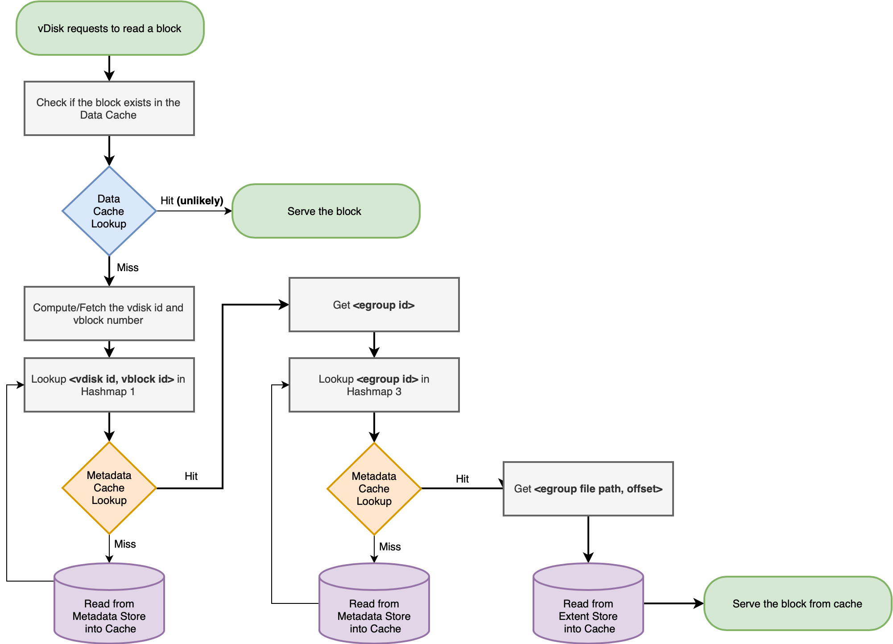

# Metadata Structure


### Hashmap 1: vblock map

`<vdisk id, vblock id> -> <egroup id>`

For each vblock (extent), there is an entry in Cassandra.
If for some reason, there is no entry for this vblock in the vdisk, metadata cache returns negative.

The entry for a vblock is divided into “regions”, which represent contiguous regions of zero as well as non-zero data.


##### Cassandra lookup for extent `<vdisk: 3188, vblock: 0>`

```
regions {
	length: 4096
	extent_id {
		vdisk_block: 0,
        egoup_mapping_in_eid_map: true
		owner_id: 420
	}
}
regions {
block_offset: 4096
length: 36864
}
regions {
	block_offset: 40690
	length: 4096
	extent_offset: 40960
	extent_id {
		vdisk_block: 0,
		owner_id: 3188
	}
	extent_group_id: 3192	
}
regions {
	block_offset: 45056
}
```

The second and fourth regions have no data.

The first region is not modified by the child vdisk, so it will “point” to the region in the parent vdisk.

### Hashmap 2: eid map

`<(parent) vdisk id, vblock id> -> <egroup id>`

This hashmap is looked up only when there is no egroup id mapped to <vdisk, vblock> key pair in the 1st Hashmap.

When we take a snapshot of a vdisk, all metadata (and data) is not copied for the child vdisk. That is, there will be no egroup id mapped for that vdisk’s vblocks, because no new egroup is created. The corresponding eids of child vdisk will “point” to the parent vdisk eids, and those will be looked up in this map. A special flag “egoup_mapping_in_eid_map” is set to true to indicate this relation. 

This map is not much relevant to us.


##### Cassandra lookup for eid `<vdisk_id: 416, vblock_id: 0, egroup_mapping_in_eid_map: true>`

```
extent_group_id: 418
```

### Hashmap 3: egroup id map

`<egroup id> -> <egroup file path, file offset>`

To identify the slice which has the required data, we take the offset from the incoming read request and do a modulo 1MB. Since there are 32 slices of 32KB each, our block will be mapped to one of those slices.
From the slice, we get the egroup file offset.
An egroup is stored in a file with the name as “3192.egroup” where 3192 is the egroup id.


##### Cassandra lookup for `<egroup id: 3192>`

```
SliceState #0:
	slice_id: 0
	untransformed_length: 32768
	extent_group_offset: 0
	transformed_length: 32768
	checksum: xxx
	checksum: xxx
	checksum: xxx
	checksum: xxx

SliceState #1:
	slice_id: 1
	untransformed_length: 32768
	extent_group_offset: 32768
	transformed_length: 32768
	checksum: xxx
	checksum: xxx
	checksum: xxx
	checksum: xxx

ExtentState #0:
	extent_id {
		vdisk_block: 0
		owner_id: 3188
	}
	slice_ids: 0
	…
	slice_ids: 31
	first_slice_offset: 0
	refcount: 1
	unallocated_slices_bitset: 4294967292
```

<br />
--
<br />


Figure: Flow Chart depicting a high-level overview of a read request

The directed path in bold is the minimal flow taken on every disk read request.

<br />
--
<br />

Separate parts of the cache have the data and the metadata. We are interested only in the metadata cache.
There is metadata for each slice, extent, egroup etc.

For each data read/write request, we will have some changes in one or more metadata structure/maps. The most important one is when data is first written to an extent.

##### vDisk
* Storage as viewed by the VMs.
* It is composed of several extents. Since extents are not all stored in one file, and are striped across multiple egroups, there is no single vdisk file.
* So, in order to read a complete vdisk, a lot of metadata lookups are needed.
* Each vdisk is assigned an id (owner id) and all to identify the incoming I/O requests.

##### Region
* Cassandra has regions for vblock metadata. A regions contains a contiguous chunk of data (for both zero and non-zero data). 
* An extent is essentially divided into regions for compact representation.
* If there is space left in the vblock, then a “zero” region represents it. The zero region does not have an egroup id.

##### Extent (vblock)
* 1 MB in size.
* The extent id is `<vdisk id, vblock id>`.
* A vblock is like an extent. All writes to a 1MB (aligned) chunk of the vdisk will be done to the same extent. Without snapshots, a vblock and an extent have 1:1 correspondence.

##### Extent Group (egroup)
* 4 MB in size.
* Each egroup has 4 extents and associated metadata. The vdisk id and vblock id are stored as part of an extent’s metadata.
* An egroup has 4 extents (ExtentState), and each of those extents has 32 Slices. Similarly, an egroup has 128 slices (SliceState).
* Each egroup also has 128 slices and associated metadata. The field we are interested in for each slice is the extent_group_offset which tells us the offset into this egroup file where this slice’s data is stored.

##### Slice
* 32 KB in size (by default).
* The slice_id ranges from 0 to 127.
* Each slice metadata has an offset into the egroup file which basically means that the particular 32 KB chunk can be found at that offset.
* The slices which belong to an extent are stored as part of the extent metadata.

##### Block
* 4 KB in size.
* The assumption is that the guest issues read requests with this granularity.


<br />
--
<br />

### vDisk Snapshots

When a vDisk is snapshotted, no new egroups are created to store its data. Instead, its metadata is made to point to the parent vDisk’s egroups. When a write happens to the child vDisk, the region where the write happened is recorded and is updated with new metadata (of its own). See the example in Hashmap 1.


### Unified Cache = Range Cache + Metadata Cache

Range cache is the part where block data is stored. Metadata cache is the in-memory component of Cassandra, storing the metadata key-value pairs.

It can be assumed that the data is almost never found in the Range Cache, and we have to read it from the disk.

For the scope of this project, we can assume that the cache consists of only one pool which is completely in-memory and limited in size.


### Cache Invalidation

Since we are not concerned about the data cache, the only invalidation needed is for the stale metadata stored in the cache.

One scenario where this can happen is when a vdisk, which was being read on host A is now being read from host B (migration A->B), and then again from host A (migration B->A).
The metadata on host A for that vdisk is stale and should not be read.

There is a coarse-grained mechanism for invalidating this data in bulk, and this is outside the scope of this project as of now.

## TO-DO List:
* 


